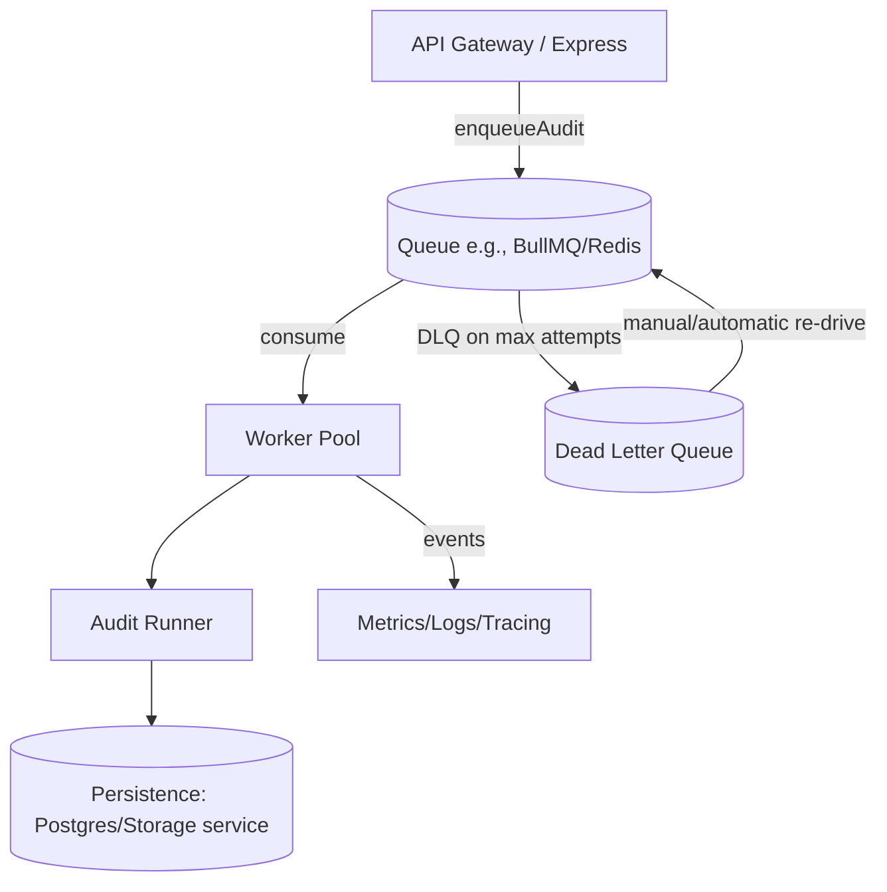

# Reliable Audit Runs via Queue (MVP)

This document describes the MVP job execution layer for asynchronous web audits. It covers the canonical job payload, idempotency, API contracts, worker lifecycle, retry/DLQ behavior, observability, multi-tenant isolation, and a minimal test plan.

## Architecture



**Assumptions**
- Use BullMQ + Redis for durable queuing, delayed retries, and native dead-lettering. Alternate queues (SQS, RabbitMQ) can swap in with similar semantics.
- Storage for idempotency + run tracking lives in Redis (fast, TTL) with a backing relational table for run state and results.

## Standard Job Contract

Canonical payload validated at enqueue and worker start:

```json
{
  "tenantId": "uuid",
  "userId": "uuid",
  "url": "https://example.com",
  "auditType": "meta|accessibility|seo",
  "requestId": "client-provided-or-generated uuid"
}
```

Validation rules:
- `tenantId`, `userId`, `requestId`: non-empty strings (UUID-formatted).
- `url`: absolute HTTP/HTTPS URL; normalize by prepending `https://` when missing scheme.
- `auditType`: enumerated string.

Workers re-validate payload from the queue to avoid trusting producer input.

## Idempotency & De-duplication

- **Key derivation**: `idempotencyKey = hash(tenantId + auditType + normalizedUrl + requestId)`.
  - If the client provides a stable `requestId`, duplicates always map to the same run. Without a requestId, generate one and also store a short sliding window key `tenantId|auditType|url|roundDown(now,15m)` to collapse accidental double clicks.
- **Storage**: Redis set holding `{idempotencyKey -> runId}` with TTL 24h. Run metadata persisted in `audit_runs` table (runId, status, timestamps, tenantId, userId, requestId, auditType, url, lastError, attemptCount).
- **Behavior**: enqueue checks Redis; if a runId exists, return that run reference (status fetched from DB) without enqueuing a new job. On first enqueue, write the key with runId before pushing to queue, ensuring workers will not execute duplicates even on retries.

## Job Lifecycle & Status

Statuses surfaced to clients: `queued`, `processing`, `succeeded`, `failed`.

State transitions:
- `queued` (upon accepted enqueue) → `processing` (worker claim) → `succeeded` (on completion) or `failed` (non-retryable or max-attempts exceeded).
- Store `attemptCount`, `startedAt`, `finishedAt`, `durationMs`, `errorCategory`, `lastError`.

## API Contracts

### Enqueue Audit
`POST /api/audits`

Request body:
```json
{ "url": "https://example.com", "auditType": "meta", "requestId": "optional-uuid" }
```
(Context supplies `tenantId`, `userId`.)

Response (201 Created):
```json
{
  "runId": "uuid",
  "status": "queued",
  "requestId": "<provided-or-generated>",
  "idempotencyKey": "...",
  "pollUrl": "/api/audits/{runId}",
  "deduped": false
}
```
If an existing key is found, return `{ deduped: true }` with current status and existing runId (200 OK).

### Poll Job / Fetch Result
`GET /api/audits/{runId}`

Response:
```json
{
  "runId": "uuid",
  "tenantId": "...",
  "status": "queued|processing|succeeded|failed",
  "attemptCount": 2,
  "requestId": "...",
  "auditType": "meta",
  "url": "https://example.com",
  "startedAt": "...",
  "finishedAt": "...",
  "durationMs": 1200,
  "errorCategory": "timeout|network|validation|unknown",
  "lastError": "...",
  "result": { /* present when succeeded */ }
}
```

## Worker Flow (Pseudocode)

```ts
async function processAuditJob(job) {
  const payload = validatePayload(job.data); // zod schema
  const { tenantId, userId, url, auditType, requestId } = payload;

  // tenant scoping
  assertTenantContext(job, tenantId);

  // claim run
  const run = await runsRepo.get(runIdFrom(job));
  if (!run || run.status === 'succeeded') return run; // safety against duplicates

  await runsRepo.markProcessing(run.id, attempt(job));
  const started = Date.now();

  try {
    const result = await auditRunner.execute({ tenantId, userId, url, auditType });
    await runsRepo.markSucceeded(run.id, {
      durationMs: Date.now() - started,
      attempt: attempt(job),
      result,
    });
    emitMetric('audit.succeeded', {...});
    return result;
  } catch (err) {
    const retryable = isRetryable(err);
    await runsRepo.markFailed(run.id, {
      durationMs: Date.now() - started,
      attempt: attempt(job),
      errorCategory: categorize(err),
      retryable,
      lastError: err.message,
    });

    if (!retryable) throw new NonRetryableError(err);
    throw err; // allow queue to schedule retry with backoff
  }
}

queue.process({
  concurrency: WORKER_CONCURRENCY,
  backoff: { type: 'exponential', delay: 1500 },
  attempts: 5,
  removeOnComplete: false,
  removeOnFail: false,
}, processAuditJob);
```

## Retry, Backoff, and DLQ

- **Attempts**: up to 5 attempts per job.
- **Backoff**: exponential with jitter (e.g., base 1.5s, cap 2 minutes).
- **Retryable errors**: network timeouts, 5xx responses from target site, transient storage/queue errors.
- **Non-retryable**: URL validation failures, unsupported audit type, tenant/user authorization issues.
- **DLQ**: BullMQ `failed` queue (or SQS DLQ) receives jobs after max attempts or explicit `NonRetryableError`. DLQ items retain payload, attempts, and errorCategory. Re-drive via a controlled admin script that re-enqueues after fixing root cause.

## Observability / Metrics

Emit structured logs/metrics with `requestId` and `runId` for correlation:

```json
{ "event": "audit.queued", "runId": "...", "tenantId": "...", "auditType": "meta", "requestId": "..." }
{ "event": "audit.started", "runId": "...", "attempt": 1, "url": "https://...", "requestId": "..." }
{ "event": "audit.succeeded", "runId": "...", "durationMs": 1200, "attempt": 1, "requestId": "..." }
{ "event": "audit.failed", "runId": "...", "attempt": 2, "errorCategory": "timeout", "retryable": true, "requestId": "..." }
```

Metrics counters/ timers:
- Counts: `audit.queued`, `audit.started`, `audit.succeeded`, `audit.failed`, `audit.dlq`.
- Durations: end-to-end latency (enqueue → finish), processing duration, time-in-queue.
- Gauges: inflight per tenant, DLQ depth.

## Security & Isolation

- Queue payload includes `tenantId` and `userId`; workers must assert both match the stored run’s tenant before processing.
- Worker execution uses tenant-scoped credentials/config when fetching or persisting data; never shares results across tenants.
- API ensures request context (e.g., auth middleware) populates tenant/user prior to enqueueing.
- DLQ access is limited to admins; re-drive scripts preserve tenant boundaries.

## Minimal Test Plan

**Unit**
- Payload validation rejects bad URLs or audit types.
- Idempotency: second enqueue with same key returns existing runId without pushing to queue.
- Retry classification: `isRetryable` correctly marks validation errors as non-retryable.
- Status transitions: processing → succeeded/failed writes correct fields.

**Integration**
- Enqueue → worker processes → status becomes `succeeded`, result retrievable.
- Duplicate enqueue returns `deduped: true` and does not increment queue depth.
- Simulated transient failure retries with backoff and eventually succeeds, updating `attemptCount`.
- Persistent failure hits max attempts, lands in DLQ, and status is `failed` with errorCategory.
- Tenant isolation: job from tenant A cannot be fetched or processed under tenant B context.
